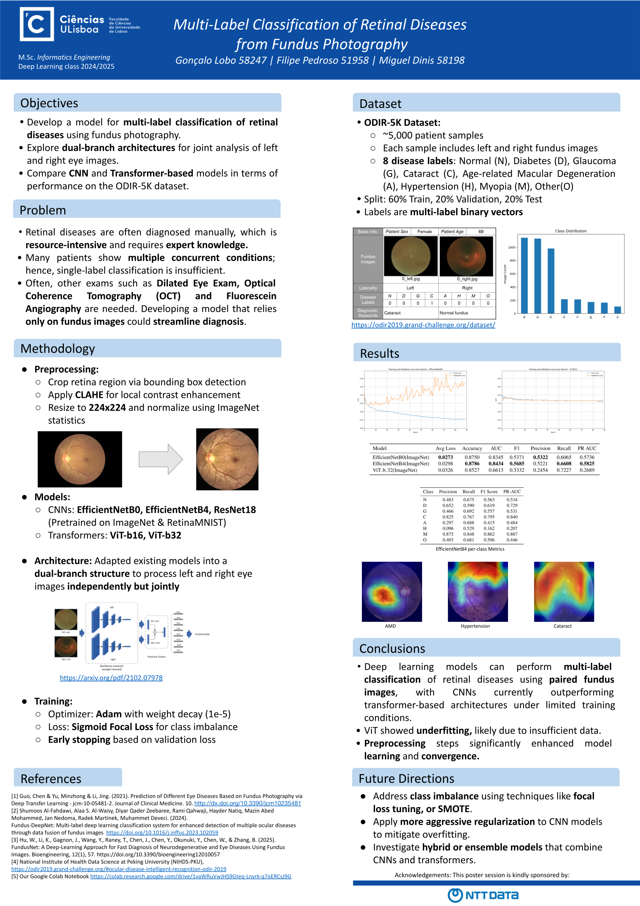

# Multi-Label Classification of Retinal Diseases from Fundus Photography

This project explores the use of convolutional neural networks and attention-based models for multi-label classification of 8 retinal diseases using left and right eye fundus images.

---

## 🖼️ Poster

